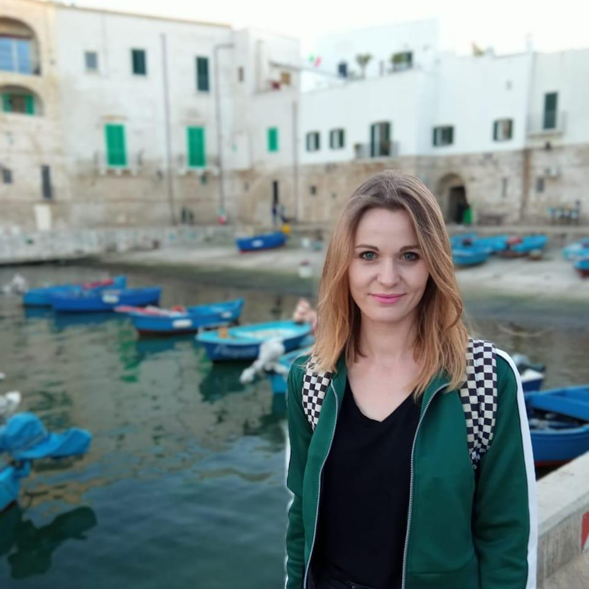

I am a **geographer** with the research focus on **remote sensing and GIS**. In February 2022, I successfully defended my PhD Dissertation in Earth and enviornmental science. My PhD thesis was entitled  **Use of remote sensing data for temperate mountain forests characteristics**.

I graduated in 2015 from the Jagiellonian University in Kraków, with a master’s degree in geography with GIS specialization. 

During my PhD I worked in two projects related to the remote sensing data and forestry. In the first project, financed by the Polish National Science Center, “Forest change detection and monitoring using passive and active remote sensing data” I worked from 2016 to 2019. It was carried out at the Institute of Geography and Spatial Management, JU. In this project, I focused on the use of time series of Sentinel-2 imagery in mapping forest species composition. The second project, in which I am working from 2019, “Innovative forest MAnagEment STrategies for a Resilient biOeconomy under climate change and disturbances (I-MAESTRO)”  is a ForestValue project. It was carried out at the Faculty of Forestry, University of Agriculture in Kraków. There I was more focused on the topics of forest disturbances in terms of monitoring them with satellite data, but also in analyzing the environmental and forest parameters that predispose to forest dieback. 

The results of my analysis was published in several papers in the international, peer-reviewed journals (see all on my [Research Gate account](https://www.researchgate.net/profile/Ewa-Grabska)).

Remote sensing, particularly optical satellite imagery is my huge passion. 

I am also enthusiast of R language, data science, spatial analysis and visualization, and sharing knowledge! 

