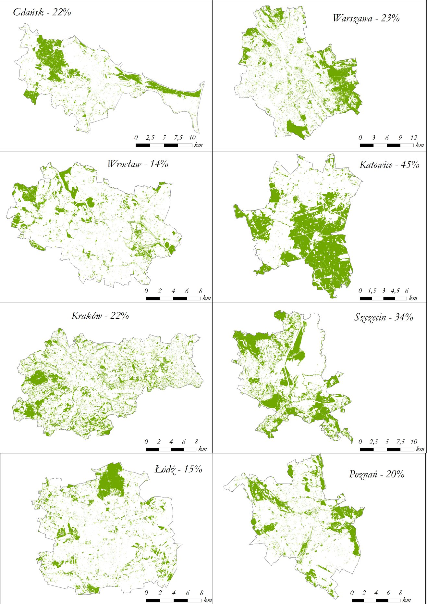
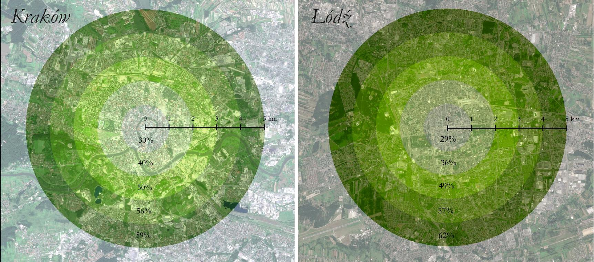
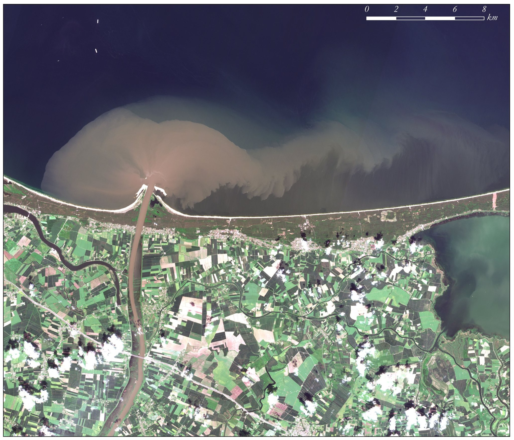

Meanders of Bug river in Poland - actual and former channel courses depicted using hillshade and elevation  - made in QGIS with elevation data from 
GUGIK Poland.

Urban green areas in selected Polish cities in summer 2017 - calculated using Sentinel-2 imagery from ESA Copernicus Programme.

Percentage of green areas in Polish cities, caluclated using NDVI derived from Sentinel-2 imagery from ESA Copernicus Programme.

Flood wave flowing into the Baltic Sea, visualization of Sentinel-2 imagery from ESA Copernicus Programme.

