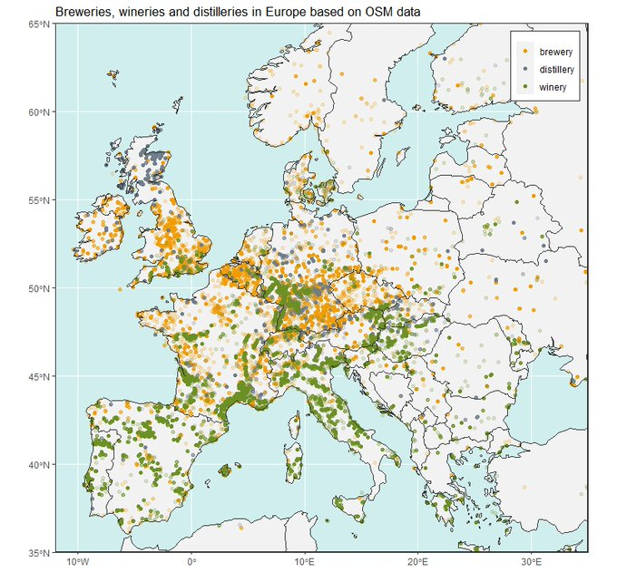

Meanders of Bug river in Poland - actual and former channel courses depicted using hillshade and elevation - made in QGIS with elevation data from 
GUGIK Poland.

Urban areas in Europe - visualization of night lights from Visible Infrared Imaging Radiometer Suite (VIIRS) downloaded from Google Earth Engine, made in QGIS.
.jpg)

Urban green areas in selected Polish cities in summer 2017 - calculated in ArcGIS using Sentinel-2 imagery from ESA Copernicus Programme.

Percentage of green areas in Polish cities, caluclated using NDVI in ArcGIS derived from Sentinel-2 imagery from ESA Copernicus Programme.

Flood wave flowing into the Baltic Sea, visualization of Sentinel-2 imagery from ESA Copernicus Programme in ArcGIS.

Map of breweries 🍺, wineries 🍷 and distilleries 🥃 locations in Europe. Made in R from OpenStreetMap data using osmadata and ggplot2 packages.

