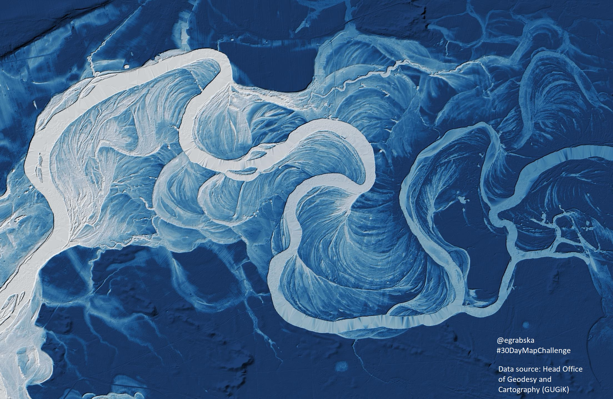

Meanders of Bug river in Poland - actual and former channel courses depicted using hillshade and elevation  - made in QGIS with elevation data from 
GUGIK Poland.

Urban green areas in selected Polish cities in summer 2017 - calculated using Sentinel-2 imagery from ESA Copernicus Programme.

