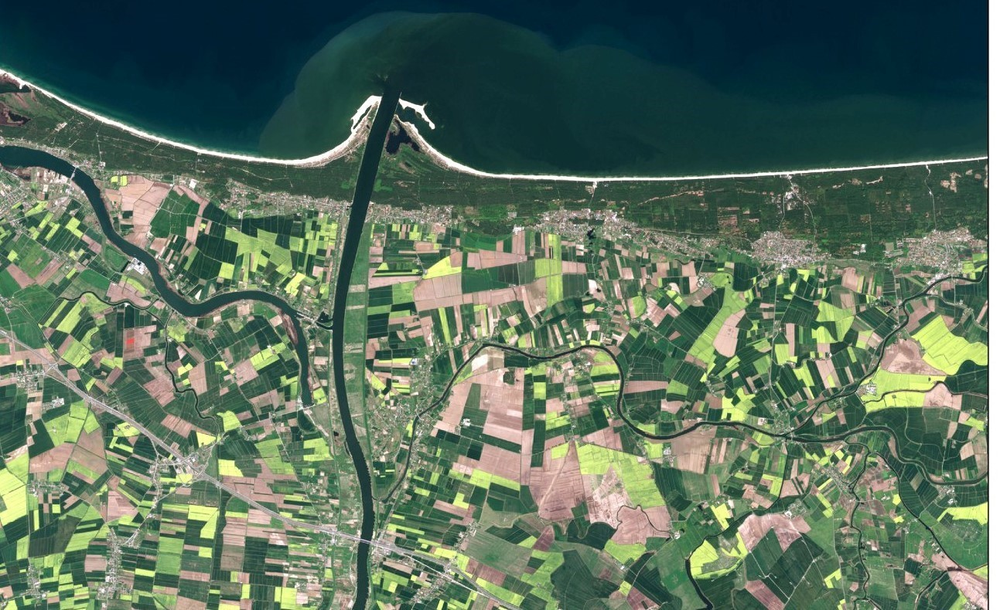

## Ewa Grabska-Szwagrzyk, PhD

Hello! I'm Ewa, PhD in Earth and environmental science, specialized in GIS and remote sensing. 
I am a scientist and a freelance GIS/remote sensing trainer.

### [About me](https://egrabska.github.io/about_me/)
### [Visualizations](https://egrabska.github.io/visualizations/)
### [Teaching](https://egrabska.github.io/teaching/)
### [Publications and conferences](https://egrabska.github.io/publications/)
### [Other](https://egrabska.github.io/others/)

### For more informaton or cooperation 
[contact me](mailto:aweaksbarg@gmail.com)
or check out my social media:
[Twitter](https://twitter.com/egrabska) 
[Research Gate](https://www.researchgate.net/profile/Ewa-Grabska-Szwagrzyk)
[Linkedin](https://www.linkedin.com/in/ewa-grabska-szwagrzyk-731b30100/)
[Polska z Sentinela](https://www.facebook.com/polskazsentinela)
