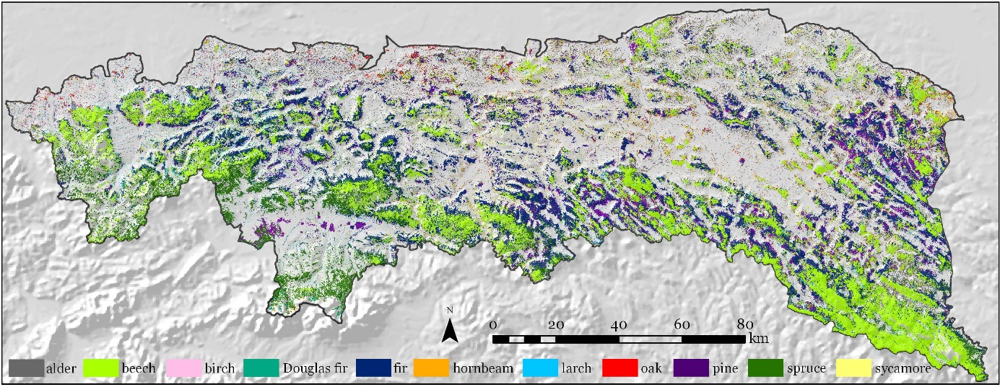

1. **Grabska, E.**; Socha, J. Evaluating the effect of stand properties and site conditions on the forest reflectance from Sentinel-2 time series. PLoS One 2021, 16, 1–23.
2. **Grabska, E.**; Frantz, D.; Ostapowicz, K. Evaluation of machine learning algorithms for forest stand species mapping using Sentinel-2 imagery and environmental data in the Polish Carpathians. Remote Sens. Environ. 2020, 251, 112103.

Map of forest species composition in the Polish Carpathian mountians. 

4. **Grabska, E.**; Hawrylo, P.; Socha, J. Continuous detection of small-scale changes in scots pine dominated stands using dense sentinel-2 time series. Remote Sens. 2020, 12.
5. **Grabska, E.**; Hostert, P.; Pflugmacher, D.; Ostapowicz, K. Forest stand species mapping using the sentinel-2 time series. Remote Sens. 2019, 11, 1–24.
6. Socha, J.; Tyminska-Czabanska, L.; **Grabska, E.**; Orzeł, S. Site index models for main forest-forming tree species in poland. Forests 2020, 11, 8–10.
7. Czabańska, L.T.; Socha, J.; Hawryło, P.; Bałazy, R.; Ciesielski, M.; **Grabska-Szwagrzyk, E.**; Netzel, P. Weather-sensitive height growth modelling of Norway spruce using repeated airborne laser scanning data. Agric. For. Meteorol. 2021, 308–309.
8. Lieskovský, J.; Kaim, D.; Balázs, P.; Boltižiar, M.; Chmiel, M.; **Grabska, E.**; Király, G.; Konkoly-Gyuró, É.; Kozak, J.; Antalová, K.; et al. Historical land use dataset of the carpathian region (1819–1980). J. Maps 2018, 14, 644–651.
9. 	Szwagrzyk, M.; Kaim, D.; Price, B.; Wypych, A.; **Grabska, E.**; Kozak, J. Impact of forecasted land use changes on flood risk in the Polish Carpathians. Nat. Hazards 2018, 94, 227–240.
10. 	**Grabska, E**. Ocena możliwości wykorzystania satelitarnych danych optycznych i radarowych do identyfikacji typów użytków rolnych. Pr. Geogr. 2017, 148, 135–155.
