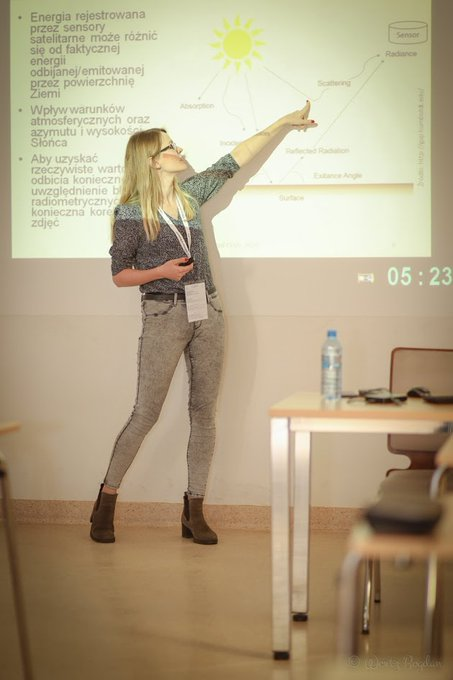

## Courses (Academia)
- Remote sensing
- Spatial analysis and visualization
- Programming in R
- Statistics

## Trainings
- Training in satellite imagery from Sentinel -1, -2 and high resolution imagery in QGIS and SNAP (organized by Polish Space Agency) for foresters
- Training in GIS and remote sensing in QGIS for Agency for Restructuring and Modernization of Agriculture employees

## Workshops
- Why R? Webinar - Satellite imagery analysis in R - see [here](https://www.youtube.com/watch?v=k1K6nqgtRL8)

Teaching the basics of satellite imagery processing in R during Spatial Analyses with Free OpenSource Software (SpAnFOSS 2020) workshops at the Faculty of Forestry, University of Agriculture in Kraków.

Me talking abour remote sensing (in Polish):

[(http://www.youtube.com/watch?v=XRNFCAY0gzM "Ziemia z kosmosu | Ewa Grabska-Szwagrzyk w cyklu Nauka Mówi")
